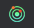
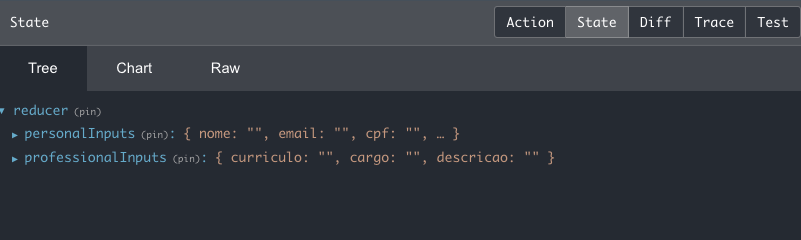

## Exercício de fixação

Vamos criar formulários utilizando `Redux`! \o/

Vocês criarão dois formulários, cada um em uma etapa, um para dados pessoais e outro para dados profissionais e exibí-los na tela.

[gif]

Para isso, é preciso salvar as informações de cada formulário no gerenciador de estados e, por fim, numa outra página, acessar esses dados para que sejam renderizados.

Você vai precisar de:
- Três páginas: uma vai renderizar o formulário de informações pessoais, outra de informações profissionais e uma para exibir as informações, além de um botão junto dos formulários que enviam as informações e passam para a página seguinte.
  
- Gerenciador de estados (Reeeedux), para salvar as informações na `store` e também para acessá-las.

Então, mãos ao código!

1 - Crie uma pasta chamada `pages`, e, dentro dela, 3 arquivos:

- PersonalForm.jsx
- ProfessionalForm.jsx
- FormDataDisplay.jsx

_Se vocês quiserem utilizar a extensão .js, tudo bem, fiquem à vontade!_
  
Não se preocupe com o conteúdo de cada uma delas, por enquanto renderize apenas uma `div` com um texto identificando cada uma das páginas.

2 - Crie as rotas dentro de `App.js` para renderizar as páginas:

- `PersonalForm` será renderizada na página principal, com a rota `'/'`.
- `ProfessionalForm` será renderizada ao acessar a rota `'/professionalForm'`
- `FormDataDisplay` será renderizada ao acessar a rota `'/formDisplay'`

3 - Crie um `fieldset` que contenha os seguintes `inputs` e os renderize em `PersonalForm.js`:

 - Nome - Texto
 - Email - Texto
 - CPF - Texto
 - Endereço - Texto
 - Cidade - Texto
 - Estado - ComboBox/Select
  - Todos os estados do Brasil 
- Um botão com o texto `Enviar` e que redireciona para a página `ProfessionalForm`

4 - Crie um `fieldset` que contenha os seguintes `inputs` e os renderize em `ProfessionalForm.js`:

 - Resumo do currículo - TextArea
 - Cargo - TextArea
 - Descrição do cargo - Texto

5 - Crie um diretório chamado `Redux`:

- Dentro da pasta "redux", crie as pastas "actions", "reducers" e "store".
- Dentro de "actions" crie um arquivo chamado `action.jsx`.
- Dentro de "reducers" crie um arquivo chamado `reducers`
- Dentro de "store" crie um arquivo chamado `store`.

Lembre-se que, ao montar a estrutura do Redux, é preciso importar o `Provider`, que recebe a `store`, no `index.js`.

**Dica: Caso esteja tendo dificuldades para montar a estrutura do Redux, você pode consultar o passo a passo que estão nesse  para se orientar.** 

6 - Salve as informações das páginas `PersonalForm` e `ProfessionalForm` na `store`.

Dica: Lembre-se que o `mapStateToProps` lê as informações da `store` e o `mapDispatchToProps` envia as informações para a `store`.

7 - Renderize, em `FormDataDisplay`, todas as informações que estão salvas na `store`.

## Exercício de fixação - Gabarito

Vamos criar formulários utilizando `Redux`! \o/

Vamos por partes! 

- Primeiramente, é necessário criar e inicializar a aplicação para que possamos visualizá-la rodando no navegador. Utilize os seguintes comandos:

& npx create-react-app my-form-redux
& cd my-form-redux
& npm start


- Agora, precisamos analisar os exercícios:

**1 - Crie uma pasta chamada `pages`, e, dentro dela, 3 arquivos:**

- PersonalForm.jsx
- ProfessionalForm.jsx
- FormDataDisplay.jsx

_Se vocês quiserem utilizar a extensão .js, tudo bem, fiquem à vontade!_
  
Não se preocupe com o conteúdo de cada uma delas, por enquanto renderize apenas uma `div` com um texto identificando cada uma das páginas.

Então vamos lá!

### Resolução exercício 1:

Precisamos criar cada uma das páginas dentro de uma pasta chamada `pages`. Essa pasta ficará dentro de `src` e como pede para não nos preocuparmos, por enquanto, com o conteúdo, vamos colocar apenas um texto com o nome da página.


 // /pages/PersonalForm.js
import React, { Component } from 'react';

class PersonalForm extends Component {
  render() {
    return (
      
PersonalForm

    );
  }
}

export default PersonalForm;




 // /pages/ProfessionalForm.js
import React, { Component } from 'react';

class ProfessionalForm extends Component {
  render() {
    return (
      
ProfessionalForm

    );
  }
}

export default ProfessionalForm;




 // /pages/FormDataDisplay.js
import React, { Component } from 'react';

class FormDataDisplay extends Component {
  render() {
    return (
      
FormDataDisplay

    );
  }
}

export default FormDataDisplay;



Com as páginas criadas, precisamos testar para ver se estão funcionando, sendo assim, podemos seguir para o exercício 2, que pede para criarmos as rotas.

**2 - Crie as rotas dentro de `App.js` para renderizar as páginas:**

- `PersonalForm` será renderizada na página principal, com a rota `'/'`.
- `ProfessionalForm` será renderizada ao acessar a rota `'/professionalform'`
- `FormDataDisplay` será renderizada ao acessar a rota `'/formdisplay'`

### Resolução exercício 2:

Aqui vamos passar o nosso componente `App.js` para classe, mantendo o padrão do nosso código e agora que temos nossa estrutura de páginas pronta, podemos partir para o próximo passo, a criação das rotas!
Mas antes, é necessário instalar o `react-router-dom` com o comando: `npm install react-router-dom`

Precisamos importar o `BrowserRouter`, o `Route` e o `Switch` e renderizar a página para cada uma das rotas.



import React, { Component } from 'react';
import { BrowserRouter, Route, Switch } from 'react-router-dom';
import PersonalForms from './pages/PersonalForms';
import ProfessionalForm from './pages/ProfessionalForm';
import FormDataDisplay from './pages/FormDataDisplay';

class App extends Component {
  render() {
    return (
      

      <BrowserRouter>
        <Switch>
          <Route exact path="/" component={ PersonalForm } />
          <Route path="/professionalform" component={ ProfessionalForm } />
          <Route path="/formdisplay" component={ FormDataDisplay } />
        </Switch>
      </BrowserRouter>
      

    );
  }
}

export default App;



Teste as rotas para ver se estão renderizando o conteúdo correto e então, vamos partir para o exercício 3!

**3 - Crie um `fieldset` que contenha os seguintes `inputs` e os renderize em `PersonalForm.js`:**

 - Nome - Texto
 - Email - Texto
 - CPF - Texto
 - Endereço - Texto
 - Cidade - Texto
 - Estado - ComboBox/Select
  - Todos os estados do Brasil 
 - Um botão com o texto `Enviar` e que redireciona para a página `ProfessionalForm`

### Resolução exercício 3:

Agora, precisamos renderizar os componentes dentro de `PersonalForms`. Analisando o formulário precisamos de um input para o `nome`, `email`, `CPF`, `endereço` e `cidade`. Como esses inputs possuem a mesma estrutura, podemos fazer o que?

Componentizar! \o/

_Calma! Não esquecemos do combobox/select e nem do button, vamos componentizá-los também!_

Dentro de `src` vamos criar a pasta `components` e dentro dela, os nossos componentes de `Input` e combobox, que no caso será o `Select`.


// components/Input.js

import React, { Component } from 'react';

class Input extends Component {
  render() {
    const { type, name, label, onChange, value, id } = this.props;
    return (
      <label htmlFor={ name }>
        { label }
        <input
          type={ type }
          name={ name }
          value={ value }
          onChange={ onChange }
          id={ id }
        />
      </label>
    );
  }
}

export default Input;





// components/Select.js

import React, { Component } from 'react';

class Select extends Component {
  render() {
    const { label, name, onChange, value, id, defaultOption, defaultValue, options } = this.props;

    return (
      <label htmlFor={ name }>
        { label }
        <select
          name={ name }
          id={ id }
          required
          onChange={ onChange }
          value={ value }
        >
          <option value={ defaultValue }>{ defaultOption }</option>
          {
            options.map((option, index) => (
              <option key={ index }>{ option }</option>
            ))
          }
        </select>
      </label>
    );
  }
}

export default Select;




// components/Button.js

import React, { Component } from 'react';

class Button extends Component {
  render() {
    const { label, onClick, type } = this.props;
    return (
      <button type={ type } onClick={ onClick }>
        { label }
      </button>
    );
  }
}

export default Button;







Agora que os componentes da página `PersonalForm` estão prontos, podemos estruturá-la, salvando o que a pessoa usuária digita no estado do componente:


  import React, { Component } from 'react';

class PersonalForm extends Component {
  constructor() {
    super();

    this.state = {
      nome: '',
      email: '',
      cpf: '',
      endereco: '',
      cidade: '',
      estado: '',
    }

    this.handleChange = this.handleChange.bind(this);
    this.onSubmitForm = this.onSubmitForm.bind(this);
  }

  // Função genérica para salvar o que é digitado no input dentro do estado
  handleChange({ target }) {
    const { name, value } = target;
    this.setState({ [name]: value });
  }

  // Função executada ao clicar no botão
  // Por enquanto vai exibir um console.log com as informações
  // do estado e vai redirecionar para a página seguinte
   onSubmitForm() {
    const { history } = this.props;
    console.log(this.state)
    history.push('/professionalform');
  }

  render() {
    const { nome, email, cpf, endereco, cidade, estado } = this.state;

  // Constante com alguns estados do Brasil, que será passada
  // através das props para o componente Select
  // que irá receber esse array e fazer o map das opções
    const states = [
      'Rio de Janeiro',
      'Minas Gerais', 'Amapá', 'Amazonas', 'São Paulo', 'Ceará', 'Distrito Federal'
    ];

    return (
      <fieldset>
        <Input
          label="nome: "
          type="text"
          onChange={ this.handleChange }
          value={ nome }
          name="nome"
          required
        />
        <Input
          label="email: "
          type="text"
          onChange={ this.handleChange }
          value={ email }
          name="email"
          required
        />
        <Input
          label="cpf: "
          type="text"
          onChange={ this.handleChange }
          value={ cpf }
          name="cpf"
          required
        />
        <Input
          label="endereco: "
          type="text"
          onChange={ this.handleChange }
          value={ endereco }
          name="endereco"
          required
        />
        <Input
          label="cidade: "
          type="text"
          onChange={ this.handleChange }
          name="cidade"
          value={ cidade }
        />
        <Select
          defaultOption="Selecione"
          onChange={ this.handleChange }
          value={ estado }
          label="Estado: "
          id="estado"
          name="estado"
          options={ states }
        />
        <Button type="button" label="Enviar" onClick={ this.onSubmitForm } />
      </fieldset>
    );
  }
}

export default PersonalForm;


O quarto exercício pede para criarmos outro `fieldset`, mas agora em `ProfessionalForm`.

**4 - Crie um `fieldset` que contenha os seguintes `inputs` e os renderize em `ProfessionalForm.js`:**

 - Resumo do currículo - TextArea
 - Cargo - TextArea
 - Descrição do cargo - Texto

### Resolução exercício 4:

Observando bem, temos dois componentes com a mesma estrutura, o `Resumo do currículo` e o `Cargo` vão ser `textarea`, ou seja...

Componetizar! \o/



// components/TextArea.js

import React, { Component } from 'react';

class TextArea extends Component {
  render() {
    const { name, label, onChange, value, maxLength } = this.props;
    return (
      <label htmlFor={ name }>
        { label }
        <textarea
          name={ name }
          value={ value }
          onChange={ onChange }
          maxLength={ maxLength }
        />
      </label>
    );
  }
}

export default TextArea;



Pronto, componentes feitos! \o\

PS: Pra nossa sorte, a `Descrição do cargo` é um `input` do tipo texto e já temos esse componente, além de já ter também o componente de botão, que vai nos levar para a página `FormDataDisplay`.

Agora precisamos montar a estrutura da página:


// /pages/ProfessionalForm.js

import React, { Component } from 'react';
import Input from '../components/Input';
import TextArea from '../components/TextArea';
import Button from '../components/Button';

class ProfessionalForm extends Component {
  constructor() {
    super();

    this.state = {
      curriculo: '',
      cargo: '',
      descricao: '',
    }

    this.handleChange = this.handleChange.bind(this);
    this.onSubmitForm = this.onSubmitForm.bind(this);
  }

  handleChange({ target }) {
    const { name, value } = target;
    this.setState({ [name]: value });
  }

  onSubmitForm() {
    const { history } = this.props;
    console.log(this.state);
    history.push('/formdisplay');
  }

  render() {
    const { curriculo, cargo, descricao } = this.state;
    return (
      <fieldset>
        <TextArea
          label="Resumo do currículo: "
          value={ curriculo }
          name="curriculo"
          maxLength="1000"
          onChange={ this.handleChange }
          required
        />
        <Input
          label="Cargo:"
          name="cargo"
          type="text"
          value={ cargo }
          onChange={ this.handleChange }
          required
        />
        <TextArea
          label="Descrição do cargo: "
          name="descricao"
          maxLength="500"
          onChange={ this.handleChange }
          value={ descricao }
          required
        />
        <Button type="button" label="Enviar" onClick={ this.onSubmitForm } />
      </fieldset>
    );
  }
}

export default ProfessionalForm;



Temos nossa estrutura, temos nossas rotas e agora chegou o momento mais esperado, a aplicação do **_Redux_**, yaaaay \o/!
Antes de tudo, precisamos instalar o `react-redux`. Para isso, utilizamos o comando: `npm install redux react-redux`

Feita a instalação, vamos para o que interessa, O CÓDIGO! 

O exercício 5 diz:

**5 - Crie um diretório chamado `Redux`:**

- Dentro da pasta "redux", crie as pastas "actions", "reducers" e "store".
- Dentro de "actions" crie um arquivo chamado `action.jsx`.
- Dentro de "reducers" crie um arquivo chamado `reducers`
- Dentro de "store" crie um arquivo chamado `store`.

Lembre-se que, ao montar a estrutura do Redux, é preciso importar o `Provider`, que recebe a `store`, no `index.js`.

### Resolução exercício 5:

Primeiro, vamos montar a estrutura do Redux e aos poucos vamos complementando com as informações necessárias.

- Crie uma pasta chamada "redux"
- Dentro da pasta _"redux"_, crie as pastas: _"store"_, _"reducer"_ e _"actions"_
- Dentro da pasta _"store"_, crie um arquivo `store.js`
- Dentro da pasta _"reducer"_ crie um arquivo `reducer.js` e outro arquivo `index.js`
- Dentro da pasta _"actions"_ crie um arquivo chamado `actions.js`
  
O `reducer` será responsável pela manipulação da store de acordo com as `actions` que vai receber. A estrutura do `reducer` consiste em ter o estado inicial do formulário `PersonalForm` e do `ProfessionalForm`, lembrando que:

- O `PersonalForm` contém as informações relativas à: `nome`, `email`, `cpf`, `endereço`, `cidade` e `estado`
- O `ProfessionalForm` contém as informações relativas à: `currículo`, `cargo` e `descrição`

Como ainda não temos as nossas `actions` e nem o que cada uma delas irá fazer, criremos o nosso `reducer` com o `switch` apenas com o `default`. Mais pra frente iremos complementá-lo.



// src/redux/reducer/reducer.js

const initialState = {
  personalInputs: {
    nome: '',
    email: '',
    cpf: '',
    endereco: '',
    cidade: '',
    estado: '',
  },
  professionalInputs: {
    curriculo: '',
    cargo: '',
    descricao: '',
  },
};

const reducer = (state = initialState, action) => {
  switch (action.type) {
    default: return state;
  }
};

export default reducer;



Todo estado de sua aplicação será armazenado pela `store`. Ela executada a partir da função `createStore()` que recebe dois parâmetros:

1) o primeiro parâmetro vai receber nosso `reducer`. Lembrando que quando temos mais de um `reducer` precisamos unir os `reducers`, para isso, no arquivo `index.js`, vamos colocar todos os `reducers` da aplicação e combiná-los atráves da função `combineReducers()`. É através dessa função que a `store` tem acesso a todos os estados manipulados.
Na nossa aplicação, vamos utilizar apenas um reducer, mas é bom já deixarmos estruturado.

    
    // src/redux/reducer/index.jsx

    import { combineReducers } from 'redux';
    import reducer from './reducer';

    const rootReducer = combineReducers({ reducer });

    export default rootReducer;

    

2) o segundo parâmetro vai ser o `composeWithDevTools()` que irá permitir a visualização dos seus estados no Redux pelo navegador com a [extensão](https://chrome.google.com/webstore/detail/redux-devtools/lmhkpmbekcpmknklioeibfkpmmfibljd?hl=pt-BR) `Redux Devtools` e para conectá-lo na aplicação, basta instalar utilizar a seguinte linha de comando `npm i redux-devtools-extension`.

**_OBS: Se a extensão Redux Devtools não estiver instalada, a linha de configuração dela apresentará um erro no navegador._**



// src/redux/store/store.jsx

import { createStore } from 'redux';
import { composeWithDevTools } from 'redux-devtools-extension';
import rootReducer from '../reducer';

const store = createStore(rootReducer, composeWithDevTools());

export default store;



Antes de criar as nossas `actions`, vamos importar a nossa `store` e o `Provider` dentro do `index.js` na raíz da nossa aplicação.


// index.js
import React from 'react';
import { Provider } from 'react-redux';
import ReactDOM from 'react-dom';
import store from './redux/store/store';
import App from './App';

ReactDOM.render(
  <React.StrictMode>
    <Provider store={ store }>
      <App />
    </Provider>
  </React.StrictMode>,
  document.getElementById('root'),
);



Atualize seu navegador e perceba que agora a extensão está ativada  e você consegue visualizar os estados da sua `store` na aba `state`.

Agora, precisamos implementar as nossas `actions`! 

As `actions` são objetos javascript responsáveis por levar a informação para o nosso reducer, se comunicando através do `type`. Mas como disparamos essas `actions`? Ou seja, como disparamos esse objeto? Fazemos isso através de uma função, essa função é chamada de `action creator` e que retorna um objeto, ou seja, nossa `action`.

- Vamos criar as `action creators` e cada uma delas será responsável por carregar (ou não) uma informação (payload) para atualizar a `store` e, obrigatoriamente um `type`, que é o tipo da nossa `action`:

- `'SET_PERSONAL_VALUE'` será o tipo da action responsável por atualizar o estado do formulário `PersonalForm`.
- `'SET_PROFESSIONAL_VALUE'` será o tipo da action responsável por atualizar o estado do formulário `ProfessionalForm`

- `setPersnalValue` será a `action creator` responsável por enviar a `action` com as informações sobre o `PersonalForm`.
- `setProfessionalValue` será a `action creator`, função responsável por enviar a `action` com as informações sobre o `ProfessionalForm`.

É através do `type` da nossa `action` que o `reducer` sabe onde ele precisa atualizar a informação.

Dica: Vamos utilizar o `export const` para podermos importar essas `actions` no nosso `reducer`, a fim de manter um padrão e não ter erro de digitação. Você pode criar um arquivo `types.js` para salvar os tipos das `actions` e importá-los tanto no arquivo `actions.js` quanto no `reducer.js`.



// src/redux/action/action.js

export const SET_PERSONAL_VALUE = 'SET_PERSONAL_VALUE';
export const SET_PROFESSIONAL_VALUE = 'SET_PROFESSIONAL_VALUE';

export const setPersonalValue = (payload) => ({ type: SET_PERSONAL_VALUE, payload });

export const setProfessionalValue = (payload) => (
  { type: SET_PROFESSIONAL_VALUE, payload }
);



Não podemos esquecer agora do nosso `reducer`:



import { SET_PROFESSIONAL_VALUE, SET_PERSONAL_VALUE } from '../actions/actions';

const initialState = {
  personalInputs: {
    nome: '',
    email: '',
    cpf: '',
    endereco: '',
    cidade: '',
    estado: '',
  },
  professionalInputs: {
    curriculo: '',
    cargo: '',
    descricao: '',
  },
};

const reducer = (state = initialState, action) => {
  switch (action.type) {
  // Caso o tipo da actio seja SET_PROFESSIONAL_VALUE,
  // retorne o que já existe no estado e atualize
  // o professionalInputs com a informação trazida pela action
  case SET_PROFESSIONAL_VALUE:
    return ({
      ...state,
      professionalInputs: action.payload,
    });
  case SET_PERSONAL_VALUE:
    return ({
      ...state,
      personalInputs: action.payload,
    });
  default: return state;
  }
};

export default reducer;



Pronto, toda a estrutura do nosso Redux está pronta, agora precisamos capturar os estados das nossas páginas `PersonalForm` e `ProfessionalForm`, salvá-las na `store`. 
Ao acessar a página `FormDataDisplay`, precisamos recuperar essas informações da `store` e exibí-las na tela, como pede o exercício 6:

**6 - Salve as informações das páginas `PersonalForm` e `ProfessionalForm` na `store`.**

Dica: Lembre-se que o `mapStateToProps` lê as informações da `store` e o `mapDispatchToProps` envia as informações para a `store`.

### Resolução exercício 6:

No componente PersonalForm, vamos importar a função responsável por despachar a action que vai carregar o type `SET_PERSONAL_VALUE`, a função que retorna essa action está dentro do arquivo `action.js` e é chamada `setPersonalValue`.

Mas, para poder enviar informações para a nossa `store`, precisamos informar que vamos despachar essa ação, então, pra isso, precisamos utilizar o `mapDispatchToProps` e "apelidamos" a nossa função `setPersonalValue` de 


// pages/PersonalForm.js

import React, { Component } from 'react';
import { connect } from 'react-redux';

import { setPersonalValue } from '../redux/action/action';
import Input from '../components/Input';
import Button from '../components/Button';
import Select from '../components/Select';

class PersonalForm extends Component {
  constructor() {
    super();

    this.state = {
      nome: '',
      email: '',
      cpf: '',
      endereco: '',
      cidade: '',
      estado: '',
    }

    this.handleChange = this.handleChange.bind(this);
    this.onSubmitForm = this.onSubmitForm.bind(this);
  }

  handleChange({ target }) {
    const { name, value } = target;
    this.setState({ [name]: value });
  }

  onSubmitForm() {
    const { history, dispatchSetValue } = this.props;
    // Disparamos a nossa action através da função importada
    // de actions.js, que apelidamos de `dispatchSetValue`
    dispatchSetValue(this.state);
    history.push('/professionalform');
  }

  render() {
    const { nome, email, cpf, endereco, cidade, estado } = this.state;

    const states = [
      'Rio de Janeiro',
      'Minas Gerais', 'Amapá', 'Amazonas', 'São Paulo', 'Ceará', 'Distrito Federal'
    ];

    return (
      <fieldset>
        <Input
          label="nome: "
          type="text"
          onChange={ this.handleChange }
          value={ nome }
          name="nome"
          required
        />
        <Input
          label="email: "
          type="text"
          onChange={ this.handleChange }
          value={ email }
          name="email"
          required
        />
        <Input
          label="cpf: "
          type="text"
          onChange={ this.handleChange }
          value={ cpf }
          name="cpf"
          required
        />
        <Input
          label="endereco: "
          type="text"
          onChange={ this.handleChange }
          value={ endereco }
          name="endereco"
          required
        />
        <Input
          label="cidade: "
          type="text"
          onChange={ this.handleChange }
          name="cidade"
          value={ cidade }
        />
        <Select
          defaultOption="Selecione"
          onChange={ this.handleChange }
          value={ estado }
          label="Estado: "
          id="estado"
          name="estado"
          options={ states }
        />
        <Button label="enviar" onClick={ this.onSubmitForm } />
      </fieldset>
    );
  }
}

const mapDispatchToProps = (dispatch) => ({
  // dispatchSetValue é um "apelido" para executarmos a nossa action creator
  // Nossa action creator é a função importada do arquivo actions
  // ou seja, setPersonalValue,
  // que vai receber um parâmetro
  // esse parâmetro é o estado do nosso componente
  // aqui estamos apenas avisando que vai existir um parâmetro
  // mas o estado do componente é passado no momento da execução
  // nesse caso, dentro da função onSubmitForm
  dispatchSetValue: (valueAndName) => dispatch(setPersonalValue(valueAndName)),
});

const mapStateToProps = (state) => ({
  personalInputs: state.reducer.personalInputs,
});

export default connect(mapStateToProps, mapDispatchToProps)(PersonalForm);
// a função connect conversa com o Provider, um avisa o outro quando há alterações.



Vamos fazer praticamente a mesma coisa na `ProfessionalForm`, mas importando a função `action creator` correspondente.


// pages/ProfessionalForm.jsx

import React, { Component } from 'react';
import { connect } from 'react-redux';

import { setProfessionalValue } from '../redux/action/action';
import Input from '../components/Input';
import Button from '../components/Button';
import TextArea from '../components/TextArea';

class ProfessionalForm extends Component {
  constructor() {
    super();

    this.state = {
      curriculo: '',
      cargo: '',
      descricao: '',
    }

    this.handleChange = this.handleChange.bind(this);
    this.onSubmitForm = this.onSubmitForm.bind(this);
  }

  handleChange({ target }) {
    const { name, value } = target;
    this.setState({ [name]: value });
  }

  onSubmitForm() {
    const { history, dispatchSetValue } = this.props;
    dispatchSetValue(this.state);
    history.push('/formdisplay');
  }

  render() {
    const { curriculo, cargo, descricao } = this.state;
    return (
      <fieldset>
        <TextArea
          label="Resumo do currículo: "
          value={ curriculo }
          name="curriculo"
          maxLength="1000"
          onChange={ this.handleChange }
          required
        />
        <Input
          label="Cargo:"
          name="cargo"
          type="text"
          value={ cargo }
          onChange={ this.handleChange }
          required
        />
        <TextArea
          label="Descrição do cargo: "
          name="descricao"
          maxLength="500"
          onChange={ this.handleChange }
          value={ descricao }
          required
        />
        <Button label="enviar" onClick={ this.onSubmitForm } />
      </fieldset>
    );
  }
}

const mapDispatchToProps = (dispatch) => ({
  dispatchSetValue: (valueAndName) => dispatch(setProfessionalValue(valueAndName)),
});

const mapStateToProps = (state) => ({
  professionalInputs: state.reducer.professionalInputs,
});

export default connect(mapStateToProps, mapDispatchToProps)(ProfessionalForm);



E por último, o exercício 7! \o\

**7 - Renderize, em `FormDataDisplay`, todas as informações que estão salvas na `store`.**

### Resolução exercício 7:



// pages/FormDataDisplay.js

import React, { Component } from 'react';
import { connect } from 'react-redux';

class FormDataDisplay extends Component {
  render() {
    const { professionalInputs, personalInputs } = this.props;
    const { nome, email, cpf, endereco, cidade, estado } = personalInputs;
    const { curriculo, cargo, descricao } = professionalInputs;
    return (
      

        <h2>Dados enviados</h2>
        

          Name:
          {nome}
        

        

          Email:
          { email }
        

        

          CPF:
          { cpf }
        

        

          Endereço:
          { endereco }
        

        

          Cidade:
          { cidade }
        

        

          Estado:
          { estado }
        

        

          Currículo:
          { curriculo }
        

        

          Cargo:
          { cargo }
        

        

          Descrição do cargo:
          { descricao }
        

      

    );
  }
}

const mapStateToProps = (state) => ({
  personalInputs: state.reducer.personalInputs,
  professionalInputs: state.reducer.professionalInputs,
});

export default connect(mapStateToProps)(FormDataDisplay);
// funcionaria como (mapStateToProps, null)


Você percebeu que estamos repetindo o mesmo código várias vezes? O que podemos fazer quando isso acontece?

Componetizar! \o/

Mas agora, vamos deixar com você! ;)

Dicas:
- Se você quiser, pode criar uma pasta para cada um dos componentes, dessa forma, ao criar o `css` para cada componente, eles ficam separados em pastas. Ex: 
  components/
    Input/
      Input.js
      Input.css

- Você também pode criar um arquivo index dentro da sua pasta `components` e dentro da sua pasta `pages`, para fazer o export default de cada um dos componentes.

Exemplo:


// components/index.js

export { default as Input } from './Input';
export { default as Button } from './Button';



E dentro dos seus componentes, importar assim:


import { Input, Button } from '../components';
